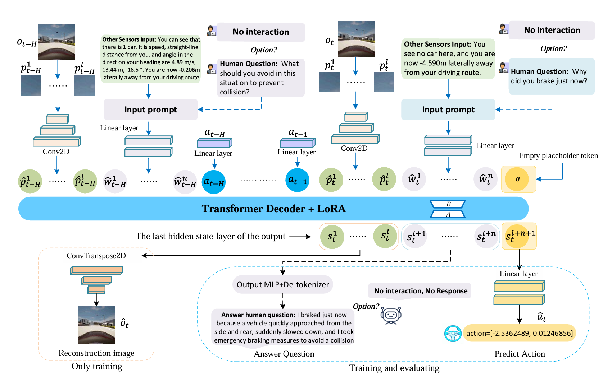

VLASCD: A Visual Language Action Model for Simultaneous Chatting and Decision Making (also termed MIMO-VLA)
======
[](LICENSE.md) [](https://www.python.org/downloads/release/python-380/)
## :fire: Overview of the MIMO-VLA (Finding our [paper](https://arxiv.org/abs/2401.11792)) 
#
In this study, we explore how to develop a multimodal pre-training framework to address the inherent task mutual exclusion in MISO architectures during MIMO scenarios (e.g., parallel multi-tasks output processing), where competing conflicts arise among different tasks sharing output channels, leading to imbalanced model optimization and significant performance degradation in specific tasks. we propose a unified MIMO training architecture with parallel multi-task output capabilities—the Visual Language Action Model for Simultaneously Chatting and Decision Making. We refer to this method as VLASCD or MIMO-VLA, and in the following, we will use these two names interchangeably. Experiments show that MIMO-VLA surpasses state-of-the-art VLA models, RL, and decision transformers in decision-making while maintaining fluent dialogue, thanks to our continuous-action handling, cost function design, and label smoothing techniques.

## 1.Installation  environment

* Run following command

`$ conda env create -f mimovla.yaml` 

`$ source activate mimovla`

If bitsandbytes doesn't work, [install it from source.](https://github.com/TimDettmers/bitsandbytes/blob/main/compile_from_source.md) Windows users can follow [these instructions](https://github.com/tloen/alpaca-lora/issues/17).

## 2.Usage
* Enter the CARLA root folder and launch the CARLA server by:
    `$ ./CarlaUE4.sh -opengl -carla-port=2000`
* You also have the option to modify other configuration parameters of the environment in the `env_carla_obschannel.py` file.

## 3.Datasets
* You can run `python datasets/collect_mimovla_training_datasets.py` by using `collect_mimovla_training_datasets.pkl`（The training datasests was obtained from the [EGADS](https://github.com/Mark-zjtang/EGADS) framework, which designs RL and IL-based agent with safety constraints, demonstrating excellent performance in CARLA). You may also modify the templates for the questions and sensor inputs based on this file.
* After that you will get a training dataset termed `MIMO_VLA_training_datasets.pkl`
  
## 4.Training & Finetuning 

* You can run `python finetune_mimovla_training.py  --base_model --data_path llama-7b-hf --batch_size  --prompt_temples --cutoff_len --lora_r --lora_alpha --input_types --is_multi_frames --is_reconstruction `
* `--base_model` In this work, our base model shares the same weights as [alpaca-lora](https://github.com/tloen/alpaca-lora?tab=readme-ov-file) . This file reads the foundation model from the Hugging Face model hub and the LoRA weights from [tloen/alpaca-lora-7b](https://huggingface.co/tloen/alpaca-lora-7b).
* `--data_path` you can used `MIMO_VLA_training_datasets.pkl`
* `--prompt_temples` The current code uses `templates/alpaca.json`, which is our modified version. If you want to use the original template, you can refer to `alpaca.json` in alpaca-lora.

## 5.Evaluating chatting and decision-making 

* Running it `python generate_chatting_decision.py --lora_weights --prompt_temples --seed --env --input_names --max_episode_length --action_repeat --episodes --carla_port --town`
* Please note that we collect the set of questions generated from the evaluation of the above-mentioned MIMO-VLA or other models, and submit them to ChatGPT-4o with the following prompt:
*"The document contains 50 similar examples as described above. For each example, based on the given Input_0: and Question_0:, please evaluate and score the responses generated by the five methods (MIMO-VLA_pred_0, Openvla_pred_0, DriverGPT4_pred_0, MIMO-VLA_image_pred_0, and MIMO-VLA_language_pred_0) using a 10-point scale with the following criteria: Not Acceptable (<3), Acceptable (3 ≤ score < 6), and Good (≥6). Please output the individual scores for each example. After evaluating all 50 examples, calculate the average rates for: Not Acceptable, Acceptable, Good, and Excellent performance for each method."*

* Installation CARLA
* An NVIDIA V100 GPU, python 3.8.3
* Based on Ubuntu 18.04 or 20.04

    `$ cd $yourfolder$/gym-carla-master`

    `$ pip install -r requirements.txt`

    `$ pip install -e .`

* Download  [CARLA_0.9.10](https://github.com/carla-simulator/carla/releases)

    `$ export PYTHONPATH=$PYTHONPATH:$YourFolder$/CARLA_0.9.10/PythonAPI/carla/dist/carla-0.9.10-py3.7-linux-x86_64.egg`
* For the evaluation of decision making, we perform real-time inference directly in CARLA. Since two modalities are output simultaneously and the generation of language is relatively slower, the evaluation of decisions is also correspondingly delayed. This issue of inference latency has not yet been addressed in our paper, and we plan to improve and optimize it in future work.

## 6.Acknowledge
Our code is mainly based on [alpaca-lora](https://github.com/tloen/alpaca-lora?tab=readme-ov-file) and [EGADS](https://github.com/Mark-zjtang/EGADS), to which we express our gratitude.

## 7.References
If you find this open source or paper release useful, please reference in your paper:
```
@article{tang2024build,
  title={VLASCD:AVisual Language Action Model for Simultaneous Chatting and Decision Making},
  author={Tang, Zuojin and Hu, Bin and Zhao, Chenyang and Ma, De and Pan, Gang and Liu, Bin},
  journal={arXiv preprint arXiv:2410.15885},
  year={2024}
}
```
